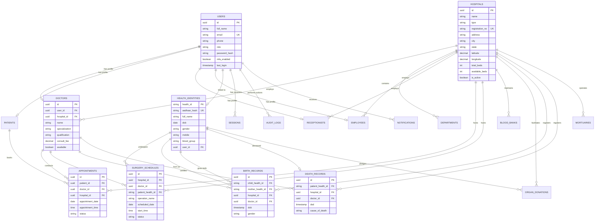

# 🗺️ SwasthyaSetu - Entity Relationship Diagram

## Overview
This document provides a comprehensive visual representation of the database schema relationships.

---

## 📊 Complete ER Diagram (Text Representation)

```
┌─────────────────────────────────────────────────────────────────────────────┐
│                         SWASTHYASETU DATABASE SCHEMA                        │
│                    India's Centralized Hospital Management System            │
└─────────────────────────────────────────────────────────────────────────────┘

┌──────────────────────────────────────────────────────────────────────────────┐
│                          AUTHENTICATION & IDENTITY LAYER                      │
└──────────────────────────────────────────────────────────────────────────────┘

┌─────────────────────┐         ┌──────────────────────────┐
│      USERS          │         │   HEALTH_IDENTITIES      │
├─────────────────────┤         ├──────────────────────────┤
│ • id (PK)           │◄───────►│ • health_id (PK)         │
│ • full_name         │   1:1   │ • aadhaar_hash (UNIQUE)  │
│ • email (UNIQUE)    │         │ • full_name              │
│ • phone             │         │ • dob                    │
│ • role              │         │ • gender                 │
│ • password_hash     │         │ • mobile                 │
│ • mfa_enabled       │         │ • blood_group            │
│ • is_active         │         │ • emergency_contact      │
│ • last_login        │         │ • user_id (FK, UNIQUE)   │
└─────────────────────┘         └──────────────────────────┘
         │                                    │
         │                                    │
         ├────────────┬──────────┬────────────┼──────────────┐
         │            │          │            │              │
         ▼            ▼          ▼            ▼              ▼
    ┌────────┐  ┌─────────┐ ┌────────┐  ┌─────────┐  ┌──────────┐
    │ DOCTOR │  │ PATIENT │ │ RECEP. │  │ EMPLOYEE│  │ SESSIONS │
    └────────┘  └─────────┘ └────────┘  └─────────┘  └──────────┘

┌──────────────────────────────────────────────────────────────────────────────┐
│                            HOSPITAL MANAGEMENT LAYER                          │
└──────────────────────────────────────────────────────────────────────────────┘

                        ┌─────────────────────────┐
                        │      HOSPITALS          │
                        ├─────────────────────────┤
                        │ • id (PK)               │
                        │ • name                  │
                        │ • type                  │
                        │ • registration_no       │
                        │ • address               │
                        │ • city, state, pincode  │
                        │ • latitude, longitude   │
                        │ • phone, email          │
                        │ • total_beds            │
                        │ • available_beds        │
                        │ • icu_beds, ot_rooms    │
                        │ • has_blood_bank        │
                        │ • has_organ_facility    │
                        │ • specializations       │
                        │ • admin_user_id (FK)    │
                        │ • is_active, verified   │
                        └─────────────────────────┘
                                    │
                ┌───────────────────┼───────────────────┐
                │                   │                   │
                ▼                   ▼                   ▼
        ┌──────────────┐    ┌──────────────┐   ┌──────────────┐
        │ DEPARTMENTS  │    │   DOCTORS    │   │  EMPLOYEES   │
        ├──────────────┤    ├──────────────┤   ├──────────────┤
        │ • id (PK)    │    │ • id (PK)    │   │ • id (PK)    │
        │ • hospital_id│◄───┤ • user_id    │   │ • user_id    │
        │ • name       │    │ • hospital_id│   │ • hospital_id│
        │ • head_dr_id │    │ • dept_id    │   │ • dept_id    │
        │ • floor_no   │    │ • name       │   │ • role       │
        └──────────────┘    │ • special.   │   │ • shift_type │
                            │ • qualif.    │   │ • employee_id│
                            │ • reg_no     │   └──────────────┘
                            │ • consult_fee│
                            │ • available  │
                            │ • opd_timings│
                            │ • rating     │
                            └──────────────┘

┌──────────────────────────────────────────────────────────────────────────────┐
│                         PATIENT CARE & OPERATIONS LAYER                       │
└──────────────────────────────────────────────────────────────────────────────┘

┌──────────────────────┐
│    APPOINTMENTS      │
├──────────────────────┤
│ • id (PK)            │
│ • appointment_number │
│ • patient_id (FK)    │───────┐
│ • doctor_id (FK)     │───┐   │
│ • hospital_id (FK)   │─┐ │   │
│ • appointment_date   │ │ │   │
│ • appointment_time   │ │ │   │
│ • status             │ │ │   │
│ • reason, notes      │ │ │   │
│ • booked_by (FK)     │ │ │   │
└──────────────────────┘ │ │   │
                         │ │   │
┌──────────────────────┐ │ │   │
│  SURGERY_SCHEDULES   │ │ │   │
├──────────────────────┤ │ │   │
│ • id (PK)            │ │ │   │
│ • surgery_number     │ │ │   │
│ • hospital_id (FK)   │─┘ │   │
│ • doctor_id (FK)     │───┘   │
│ • patient_health_id  │───────┼──────────┐
│ • operation_name     │       │          │
│ • operation_type     │       │          │
│ • ot_room            │       │          │
│ • scheduled_date     │       │          │
│ • start_time         │       │          │
│ • end_time           │       │          │
│ • status             │       │          │
│ • assisting_doctors  │       │          │
│ • consent_given      │       │          │
└──────────────────────┘       │          │
                               │          │
                               ▼          ▼
                        ┌─────────┐  ┌──────────────────┐
                        │ PATIENT │  │ HEALTH_IDENTITY  │
                        └─────────┘  └──────────────────┘

┌──────────────────────────────────────────────────────────────────────────────┐
│                         VITAL RECORDS & REGISTRY LAYER                        │
└──────────────────────────────────────────────────────────────────────────────┘

┌──────────────────────┐              ┌──────────────────────┐
│   BIRTH_RECORDS      │              │   DEATH_RECORDS      │
├──────────────────────┤              ├──────────────────────┤
│ • id (PK)            │              │ • id (PK)            │
│ • birth_cert_no      │              │ • death_cert_no      │
│ • child_health_id ───┼──────┐       │ • patient_health_id ─┼──────┐
│ • mother_health_id ──┼───┐  │       │ • hospital_id (FK)   │      │
│ • father_name        │   │  │       │ • doctor_id (FK)     │      │
│ • hospital_id (FK)   │   │  │       │ • dod                │      │
│ • doctor_id (FK)     │   │  │       │ • cause_of_death     │      │
│ • dob                │   │  │       │ • death_type         │      │
│ • gender             │   │  │       │ • autopsy_required   │      │
│ • delivery_type      │   │  │       │ • registered_at      │      │
└──────────────────────┘   │  │       └──────────────────────┘      │
                           │  │                                      │
                           ▼  ▼                                      ▼
                    ┌──────────────────┐                  ┌──────────────┐
                    │ HEALTH_IDENTITY  │◄─────────────────│  MORTUARY    │
                    │                  │                  ├──────────────┤
                    │ (Central Hub)    │                  │ • id (PK)    │
                    └──────────────────┘                  │ • hospital_id│
                           │                              │ • slot_number│
                           │                              │ • body_hid   │
                           ▼                              │ • status     │
                    ┌──────────────────┐                  │ • date_in    │
                    │ ORGAN_DONATIONS  │                  │ • date_out   │
                    ├──────────────────┤                  └──────────────┘
                    │ • id (PK)        │
                    │ • donor_hid (FK) │
                    │ • hospital_id    │
                    │ • organ_type     │
                    │ • status         │
                    │ • recipient_hid  │
                    │ • pledge_date    │
                    └──────────────────┘

┌──────────────────────────────────────────────────────────────────────────────┐
│                         HOSPITAL FACILITIES LAYER                             │
└──────────────────────────────────────────────────────────────────────────────┘

                        ┌─────────────────────┐
                        │     HOSPITALS       │
                        └─────────────────────┘
                                  │
                ┌─────────────────┼─────────────────┐
                │                 │                 │
                ▼                 ▼                 ▼
        ┌──────────────┐  ┌──────────────┐  ┌──────────────┐
        │  BLOOD_BANK  │  │   MORTUARY   │  │ORGAN_DONATION│
        ├──────────────┤  ├──────────────┤  ├──────────────┤
        │ • id (PK)    │  │ • id (PK)    │  │ • id (PK)    │
        │ • hospital_id│  │ • hospital_id│  │ • hospital_id│
        │ • blood_group│  │ • slot_number│  │ • donor_hid  │
        │ • units_avail│  │ • body_hid   │  │ • organ_type │
        │ • units_resv │  │ • status     │  │ • status     │
        │ • low_alert  │  │ • date_in/out│  │ • pledge_date│
        └──────────────┘  └──────────────┘  └──────────────┘

┌──────────────────────────────────────────────────────────────────────────────┐
│                      SECURITY & COMPLIANCE LAYER                              │
└──────────────────────────────────────────────────────────────────────────────┘

┌──────────────────────┐              ┌──────────────────────┐
│    AUDIT_LOGS        │              │     SESSIONS         │
├──────────────────────┤              ├──────────────────────┤
│ • id (PK)            │              │ • id (PK)            │
│ • user_id (FK)       │              │ • user_id (FK)       │
│ • user_role          │              │ • access_token_hash  │
│ • user_ip            │              │ • refresh_token_hash │
│ • action             │              │ • device_id          │
│ • entity_type        │              │ • ip_address         │
│ • entity_id          │              │ • issued_at          │
│ • timestamp          │              │ • expires_at         │
│ • hospital_id (FK)   │              │ • is_active          │
│ • old_value          │              │ • revoked_at         │
│ • new_value          │              └──────────────────────┘
│ • status             │
└──────────────────────┘              ┌──────────────────────┐
                                      │   NOTIFICATIONS      │
                                      ├──────────────────────┤
                                      │ • id (PK)            │
                                      │ • user_id (FK)       │
                                      │ • type               │
                                      │ • title, message     │
                                      │ • channels           │
                                      │ • sent_at, read_at   │
                                      │ • priority           │
                                      └──────────────────────┘
```

---

## 🔗 Relationship Cardinality Summary

### Core Relationships

| Parent Entity      | Relationship | Child Entity        | Type  | Notes                          |
|--------------------|--------------|---------------------|-------|--------------------------------|
| Users              | 1:1          | Doctor              | O-M   | One user can be one doctor     |
| Users              | 1:1          | Patient             | O-M   | One user can be one patient    |
| Users              | 1:1          | Receptionist        | O-M   | One user can be one receptionist|
| Users              | 1:1          | HealthIdentity      | O-O   | Optional link to digital account|
| Hospitals          | 1:N          | Doctors             | M-M   | One hospital has many doctors  |
| Hospitals          | 1:N          | Departments         | M-M   | One hospital has many depts    |
| Hospitals          | 1:N          | Employees           | M-M   | One hospital has many employees|
| Hospitals          | 1:N          | Appointments        | M-M   | One hospital has many appts    |
| Hospitals          | 1:N          | Surgeries           | M-M   | One hospital has many surgeries|
| Hospitals          | 1:N          | BloodBank           | M-M   | One hospital has blood inventory|
| Hospitals          | 1:N          | Mortuary            | M-M   | One hospital has mortuary slots|
| Doctors            | 1:N          | Appointments        | M-M   | One doctor has many appts      |
| Doctors            | 1:N          | Surgeries           | M-M   | One doctor performs surgeries  |
| Patients           | 1:N          | Appointments        | M-M   | One patient has many appts     |
| HealthIdentity     | 1:N          | Surgeries           | M-M   | One person has surgery history |
| HealthIdentity     | 1:1          | BirthRecord (child) | O-M   | One birth record per person    |
| HealthIdentity     | 1:N          | BirthRecord (mother)| M-M   | Mother can have multiple births|
| HealthIdentity     | 1:1          | DeathRecord         | O-O   | One death record per person    |
| HealthIdentity     | 1:N          | OrganDonations      | M-M   | One person can pledge multiple |

**Legend:**
- **1:1** = One-to-One
- **1:N** = One-to-Many
- **M-M** = Mandatory-Mandatory
- **O-M** = Optional-Mandatory
- **O-O** = Optional-Optional

---

## 🎨 Visual ER Diagram (Mermaid Format)



---

## 🔐 Data Flow & Access Control

### Patient Data Access Flow

```
┌─────────────┐
│   PATIENT   │
│  (via App)  │
└──────┬──────┘
       │
       ▼
┌─────────────────┐
│ AUTHENTICATION  │
│   (JWT Token)   │
└────────┬────────┘
         │
         ▼
┌──────────────────────┐
│  AUTHORIZATION       │
│  (RBAC Check)        │
└──────────┬───────────┘
           │
           ▼
    ┌──────────────┐
    │ Can Access:  │
    │ • Own Appts  │
    │ • Own Records│
    │ • Own Health │
    │   Identity   │
    └──────────────┘
```

### Doctor Data Access Flow

```
┌─────────────┐
│   DOCTOR    │
│ (via Portal)│
└──────┬──────┘
       │
       ▼
┌─────────────────┐
│ AUTHENTICATION  │
│   (JWT + MFA)   │
└────────┬────────┘
         │
         ▼
┌──────────────────────┐
│  HOSPITAL ISOLATION  │
│  (WHERE hospital_id  │
│   = doctor.hospital) │
└──────────┬───────────┘
           │
           ▼
    ┌──────────────────┐
    │ Can Access:      │
    │ • Own Patients   │
    │ • Own Appts      │
    │ • Own Surgeries  │
    │ • Hospital Data  │
    └──────────────────┘
```

### National Admin Access Flow

```
┌──────────────────┐
│ NATIONAL ADMIN   │
│ (Govt Dashboard) │
└────────┬─────────┘
         │
         ▼
┌─────────────────┐
│ AUTHENTICATION  │
│ (High Security) │
└────────┬────────┘
         │
         ▼
┌──────────────────────┐
│  READ-ONLY ACCESS    │
│  (Analytics Only)    │
└──────────┬───────────┘
           │
           ▼
    ┌──────────────────┐
    │ Can View:        │
    │ • Aggregated     │
    │   Statistics     │
    │ • Hospital Count │
    │ • Birth/Death    │
    │ • Blood Avail.   │
    │ NO MEDICAL DATA  │
    └──────────────────┘
```

---

## 📋 Key Design Decisions

### 1. **Dual Identity System**
- `Users` table for app authentication
- `HealthIdentity` for Aadhaar-linked medical records
- Optional linking between both

### 2. **Hospital-Centric Isolation**
- All operational tables have `hospital_id` foreign key
- Enforced at database level with RLS policies
- No cross-hospital data leakage

### 3. **Immutable Records**
- Birth/Death certificates cannot be modified
- Audit logs track all changes
- Soft deletes for user accounts

### 4. **Flexible Relationships**
- Surgeries linked to `HealthIdentity` (not `Patient`)
- Allows non-app users to have surgery records
- Appointments linked to `Patient` (app users only)

### 5. **Security-First**
- Aadhaar stored as SHA-256 hash
- Sensitive fields encrypted
- All actions logged in `audit_logs`

---

## 🎓 How to Explain This in Viva

### Question: "Explain your database design"

**Answer Structure:**

1. **Start with the core entities:**
   - "We have 18 main tables organized into 5 layers"
   - "Authentication, Hospital Management, Patient Care, Vital Records, and Security"

2. **Highlight the dual identity system:**
   - "Users table for app login"
   - "HealthIdentity for Aadhaar-linked medical records"
   - "This allows non-app users to still have medical records"

3. **Emphasize hospital isolation:**
   - "Every operational table has hospital_id"
   - "Doctors can only see their hospital's data"
   - "Enforced with Row-Level Security policies"

4. **Mention security:**
   - "Aadhaar is hashed, never stored raw"
   - "All critical actions logged in audit_logs"
   - "Field-level encryption for sensitive data"

5. **Explain scalability:**
   - "Indexed all foreign keys"
   - "Partitioned audit logs by month"
   - "Read replicas for analytics"

---

## 🚀 Next Steps

1. **Generate Visual Diagram**: Use tools like dbdiagram.io or draw.io
2. **Create Sample Data**: Populate with realistic test data
3. **Write Queries**: Common queries for each use case
4. **Performance Testing**: Load testing with millions of records

---

**This ER diagram demonstrates:**
✅ Normalized database design (3NF)
✅ Clear relationship cardinality
✅ Security and privacy by design
✅ Scalability considerations
✅ Real-world hospital operations modeling
