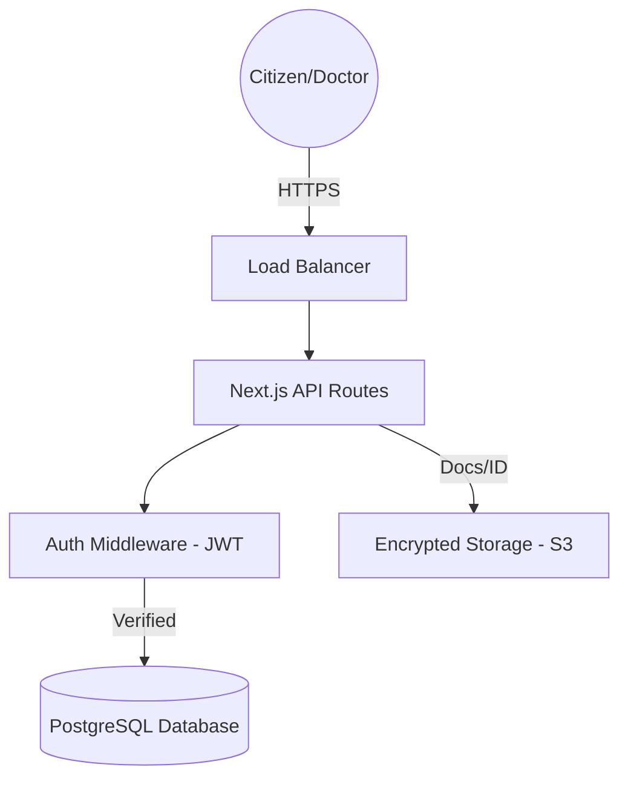

# 📄 Software Requirements Specification (SRS) - SwasthyaSetu
## Based on IEEE Standard 830-1998
**Version:** 1.0  
**Date:** 2026-01-29  
**Status:** Final-Year Project Ready

---

## 1. Introduction

### 1.1 Purpose
The purpose of this document is to provide a comprehensive description of the **SwasthyaSetu** system. It will outline the system's functionalities, performance requirements, security standards, and design constraints to ensure a successful implementation and academic review.

### 1.2 Scope
SwasthyaSetu is a **Centralized National Hospital Management System** for India. The scope includes:
- Universal Health ID (UHID) generation linked via Aadhaar (Secure Hash).
- Hospital-wise data isolation within a shared cloud infrastructure.
- Real-time inventory tracking for Blood Banks and Critical Care beds.
- Role-based access for Patients, Doctors, Receptionists, and Admins.
- Digital records portability across vetted medical nodes.

### 1.3 Definitions, Acronyms, and Abbreviations
| Term | Definition |
|------|------------|
| **UHID** | Universal Health Identity |
| **NHA** | National Health Authority |
| **RBAC** | Role-Based Access Control |
| **JWT** | JSON Web Token (Authentication mechanism) |
| **Node** | A verified clinical entity (Hospital/Lab) in the grid |
| **OTP** | One-Time Password |

### 1.4 References
- IEEE Standard 830-1998 for SRS.
- Aadhaar Act 2016 (Data Privacy Guidelines).
- National Digital Health Mission (NDHM) Blueprint.

---

## 2. Overall Description

### 2.1 Product Perspective
SwasthyaSetu is a self-contained web-based infrastructure. It acts as a middle-tier between citizens and the complex network of private/government hospitals, providing a unified interface for health services.

### 2.2 Product Functions
- **Identity Issuance**: Secure Aadhaar-based registration and Digital Health Card generation.
- **Resource Management**: Live tracking of beds, OT readiness, and blood bank units.
- **Clinical Operations**: Appointment scheduling, consultation logging, and prescription generation.
- **Emergency Protocols**: SOS routing and trauma center geolocation.
- **Security Protocols**: Multi-factor authentication and encrypted audit trails.

### 2.3 User Classes and Characteristics
1. **Citizens/Patients**: High usability requirements; need access to records and booking.
2. **Medical Practitioners**: High reliability requirements; need history access and prescription tools.
3. **Hospital Operators**: High density data entry; need queue and bed management.
4. **National Admin**: High-level telemetry; need national health matrix and audit oversight.

### 2.4 Operating Environment
- **Platform**: Web (Next.js 14).
- **Browsers**: Chrome, Safari, Edge, Firefox (Modern versions).
- **Server**: Node.js/Vercel Runtime.
- **Database**: PostgreSQL with Prisma ORM.

---

## 3. System Features

### 3.1 Universal Identity (Aadhaar Integrated)
- **Description**: Users link their Aadhaar to generate a 14-digit UHID.
- **Requirement**: Raw Aadhaar numbers must **never** be stored; only SHA-256 hashes are used for verification.

### 3.2 Dynamic Hospital Registry
- **Description**: Advanced search for hospitals based on city, type, and availability.
- **Requirement**: Real-time sync with hospital capacity nodes.

### 3.3 Clinical Command Console (Dashboards)
- **Description**: Specialized interfaces for Doctors (Prescriptions), Receptionists (Queues), and Admins (Resources).

---

## 4. External Interface Requirements

### 4.1 User Interfaces
- **Aesthetic**: Ultra-Premium Dark/Light mode with CSS Glassmorphism.
- **Framework**: Tailwind CSS + Shadcn Components.

### 4.2 Software Interfaces
- **Database**: PostgreSQL 15.
- **Authentication**: JWT via custom Next.js middleware.
- **Mapping**: Mapbox/Google Maps API for Hospital Geolocation.

---

## 5. Non-Functional Requirements

### 5.1 Performance Requirements
- Average API response time: **< 100ms**.
- Page load time (TTFB): **< 2s**.

### 5.2 Security Requirements
- **Encryption**: AES-256 at rest, TLS 1.3 in transit.
- **Authentication**: SHA-256 Aadhaar hashing + JWT token rotation.
- **Isolation**: Row-Level Security (RLS) ensuring Hospital B cannot view Hospital A records.

### 5.3 Reliability & Availability
- Planned Uptime: **99.9%**.
- Automated backups every 6 hours.

---

## 6. System Architecture (Mermaid)

---

## 7. Approval
**Prepared By:** Antigravity AI  
**Subject:** SwasthyaSetu Final Year Project Documentation
