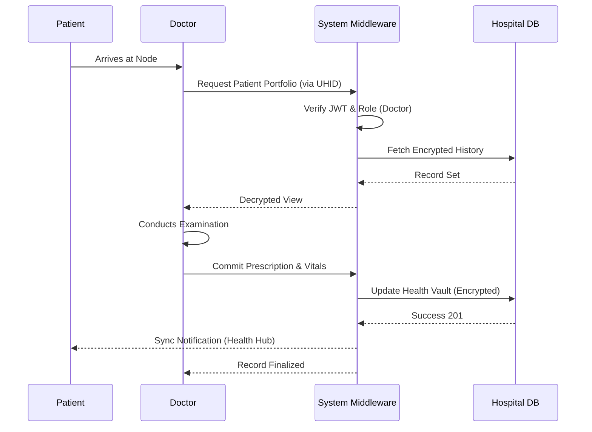
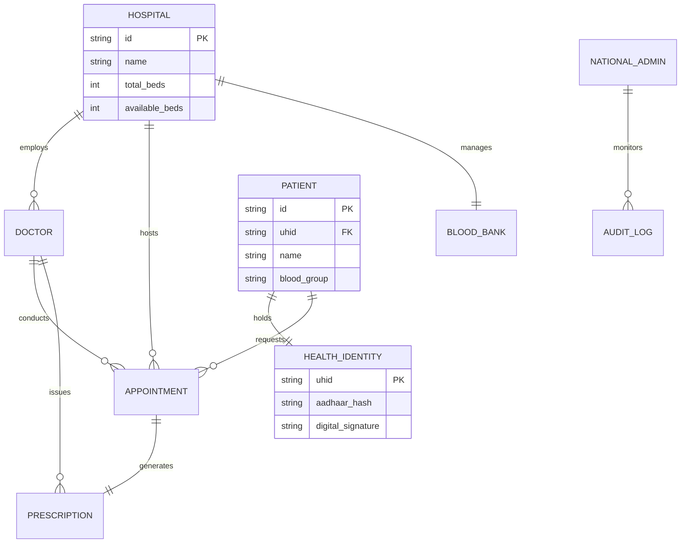
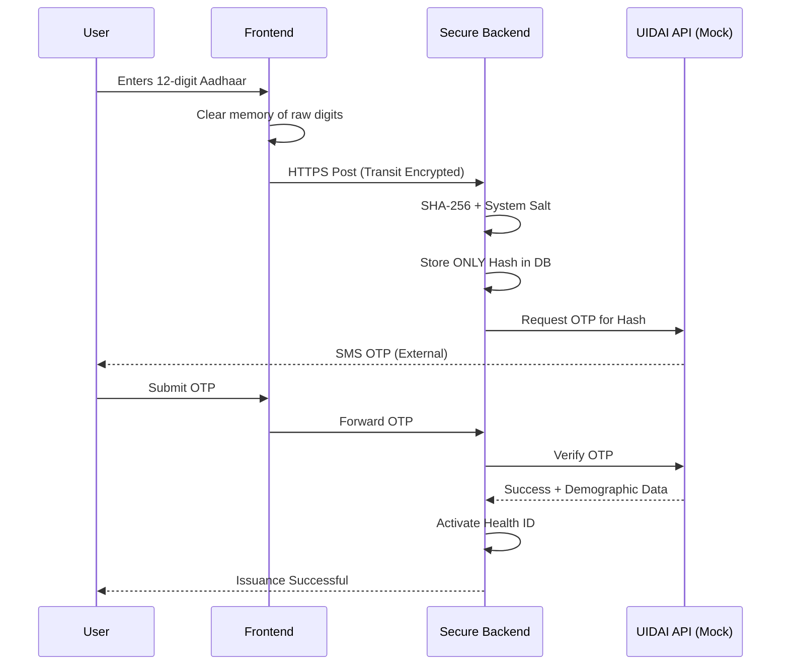

# 🗂️ Use-Case, Sequence & ER Diagrams - SwasthyaSetu

This document contains high-fidelity Mermaid diagrams explaining the logic and data flow of the National Health Infrastructure.

---

## 1. System Use-Case Diagram
Defines the interactions between different actors and the core system functionalities.

```mermaid
useCaseDiagram
    actor "Patient" as P
    actor "Doctor" as D
    actor "Receptionist" as R
    actor "National Admin" as NA
    
    package "Identity Module" {
      usecase "Register Health ID (Aadhaar)" as UC1
      usecase "Download Health Card" as UC2
    }
    
    package "Clinical Module" {
      usecase "Book Appointment" as UC3
      usecase "Process Prescription" as UC4
      usecase "View Medical History" as UC5
    }
    
    package "Infrastructure Module" {
      usecase "Manage Bed Capacity" as UC6
      usecase "Sync Blood Inventory" as UC7
      usecase "Generate National Telemetry" as UC8
    }

    P --> UC1
    P --> UC2
    P --> UC3
    
    D --> UC4
    D --> UC5
    
    R --> UC3
    R --> UC6
    
    NA --> UC8
    NA --> UC7
```

---

## 2. Sequence Diagram: Clinical Consultation
Explains the step-by-step logic when a Doctor treats a Patient.



---

## 3. Entity Relationship (ER) Perspective
A conceptual view of how national health data is structured.



---

## 4. Sequence Diagram: Aadhaar Hashing & Verification
Explains why the system is "Viva-Safe" regarding privacy.


